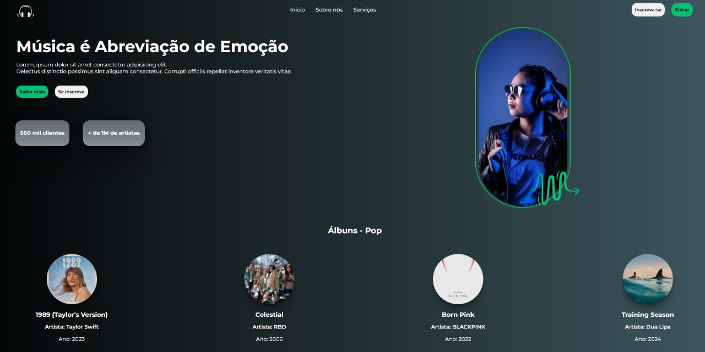
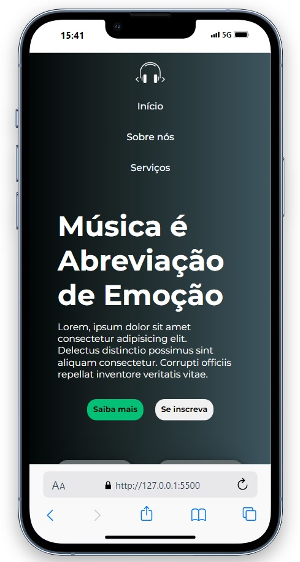

# Preview

## CodeMusic

  
  

## O que é o CodeMusic?

O CodeMusic é um serviço digital que proporciona acesso instantâneo a milhões de músicas, podcasts, vídeos e outros conteúdos de criadores de todo o mundo.

### Funcionalidades Básicas
- Reprodução de músicas gratuita.
- Recomendações personalizadas com base nos seus gostos.
- Criação de coleções de músicas e podcasts.
- E muito mais!

### CodeMusic Premium
Você pode fazer upgrade para o CodeMusic Premium para desfrutar de funcionalidades adicionais.

### Disponibilidade
O CodeMusic está disponível para diversos dispositivos, incluindo computadores, celulares, tablets, alto-falantes, TVs e carros. Além disso, é fácil alternar entre dispositivos com o CodeMusic Connect.

### Armazenamento de Músicas
O CodeMusic permite acesso a músicas e podcasts exclusivamente através dos nossos apps. Devido às licenças, não é possível exportar o conteúdo para fora do app.

# Tecnologias Utilizadas
- HTML
- CSS

# Implementações
- Formas de uso do CSS
- Seletores básicos (elementos, classes e IDs)
- Textos, fontes e cores
- Box Model
- Shadows
- Gradients
- Background
- Flexbox
- Princípios de responsividade
